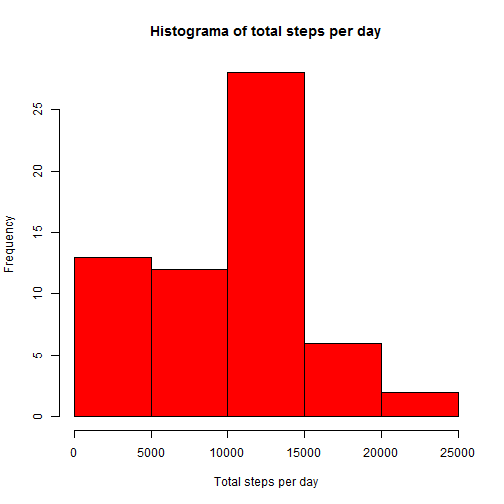
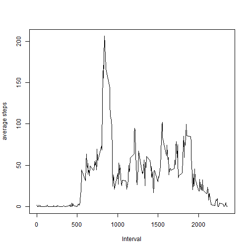
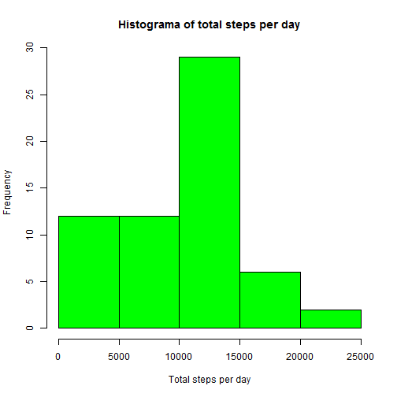
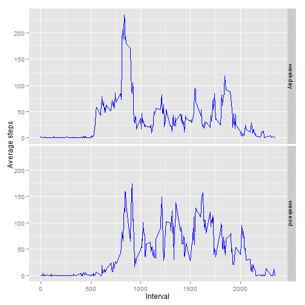

## Loading and preprocessing the data
Data are in the same folder, so we read the csv file inside the zip file and
add a variable in order to transform Date (factor variable) into a date variable.


```r
data <- read.csv(unz("activity.zip", "activity.csv"))
data$datetime <- strptime(data$date, "%Y-%m-%d")
```

## What is mean total number of steps taken per day?

```r
library(plyr)
steps_data <- ddply (data, .(date), summarize, sum = sum (steps, na.rm=TRUE),
                    mean = mean (steps, na.rm = TRUE),
                    median = median(steps, na.rm = T))
```

We can see the number of steps taken each day in this histogram. 

```r
hist(steps_data$sum, col="red", main= "Histograma of total steps per day",
     xlab="Total steps per day")
```

 

where we can see the most common total steps per day is between 10000 and 15000.

And now, the *mean* and the *median* of the total number of steps taken per day
*mean*

```r
mean(steps_data$sum)
```

```
## [1] 9354
```
and *median*

```r
median(steps_data$sum)
```

```
## [1] 10395
```


## What is the average daily activity pattern?
In first place, we calculate the average number of steps taken per echa 5-minute interval, averaged across all days


```r
ts_interval<- ddply (data, .(interval), summarize,
                     mean = mean (steps, na.rm = TRUE))
```
We make the plot:

```r
plot(ts_interval$interval, ts_interval$mean, type="l", xlab="Interval",
     ylab="average steps")
```

 

The maximun number of steps seems to be around 800. We check it

```r
ts_interval$interval[which.max(ts_interval$mean)]
```

```
## [1] 835
```


## Imputing missing values
First of all, we calculate the number of rows with NAs:

```r
data_tmp <- na.omit(data)
nrow(data) - nrow(data_tmp)
```

```
## [1] 2304
```
To replace NAs values I am going to use the mean for that interval that I have stored in ts_interval.


```r
data2 <- data
## I take all NAs
miss <- which(is.na(data2$steps), arr.ind=TRUE)
## replace them with the mean
data2$steps[miss] <- ts_interval[ts_interval$interval==data2$interval[miss],"mean"]

##the new number of steps
steps_data2 <- ddply (data2, .(date), summarize, sum = sum (steps, na.rm=TRUE))
```

After replacing NAs, We can see the number of steps taken each day in this histogram. 


```r
hist(steps_data2$sum, col="green", main= "Histograma of total steps per day",
     xlab="Total steps per day")
```

 
  
We calculate the new median and mean as we did before:
*mean*

```r
mean(steps_data2$sum)
```

```
## [1] 9531
```
and *median*

```r
median(steps_data2$sum)
```

```
## [1] 10439
```
And, as we can see, there is not a big diffirence when we replace NAs for the mean of its interval.

## Are there differences in activity patterns between weekdays and weekends?


```r
## I need to change Local system
Sys.setlocale(locale="English_United States.1252")
```

```
## [1] "LC_COLLATE=English_United States.1252;LC_CTYPE=English_United States.1252;LC_MONETARY=English_United States.1252;LC_NUMERIC=C;LC_TIME=English_United States.1252"
```

```r
data$week <- ifelse(weekdays(data$datetime)=="Saturday" | 
                         weekdays(data$datetime)=="Sunday", "weekend", "weekday" )
data$week <- as.factor(data$week)

##average number of steps taken per echa 5-minute interval, averaged across all days

ts_inter_dif<- ddply (data, .(interval, week), summarize,
                     mean = mean (steps, na.rm = TRUE))


##split dataframe into weekday and weekend
ts_wend <-ts_inter_dif[ts_inter_dif$week=="weekend",]
ts_wday <-ts_inter_dif[ts_inter_dif$week=="weekday",]
```

The plot shown the differences in activity patterns between weekdays and weekends


```r
library(ggplot2)

ggplot(data=ts_inter_dif, aes(x=interval, y=mean)) + 
     geom_line(colour="blue") + 
     facet_grid(week ~ .) +
     ylab("Average steps") +
     xlab("Interval")
```

 


It seems quite similar so there are not big differences. 

